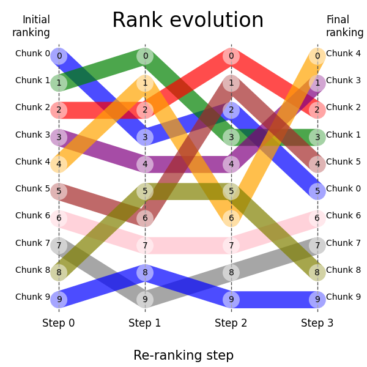

# RankFlow
RankFlow is a Python package that allows you to create rank flow plots, helping visualize the changes in ranking of nodes. Initially it was applied to re-ranking visualization of nodes (parts of documents, document chunks) during the retrieval and re-ranking processes within a Retrieval Augmented Generation (RAG) retriever but the usage is not limited to RAG.

## Installation
```bash
pip install rankflow
```

## Usage
```python
    my_step_labels: list[str] = [
        "Hybrid Search",
        "Cross-encoder",
        "Graph-reranker",
        "Booster",
    ]
    my_chunk_labels: list[str] = [
        "Doc 0",
        "Doc 1",
        "Doc 2",
        "Doc 3",
        "Doc 4",
        "Doc 5",
        "Doc 6",
        "Doc 7",
        "Doc 8",
        "Doc 9",
    ]
    my_ranks = np.array(
        [
            [0, 1, 2, 3, 4, 5, 6, 7, 8, 9],
            [3, 0, 2, 4, 1, 6, 7, 9, 5, 8],
            [2, 3, 0, 4, 6, 1, 7, 8, 5, 9],
            [5, 3, 2, 1, 0, 4, 6, 7, 8, 9],
        ]
    )

    rf = RankFlow(
        ranks=my_ranks,
        step_labels=my_step_labels,
        chunk_labels=my_chunk_labels,
        fig_size=(6, 6),
        title_font_size=24,
    )
    _ = rf.plot()

    # save the plot to png
    plt.savefig("rankflow.png")
    
    plt.show()
```

This should produce the following plot:


